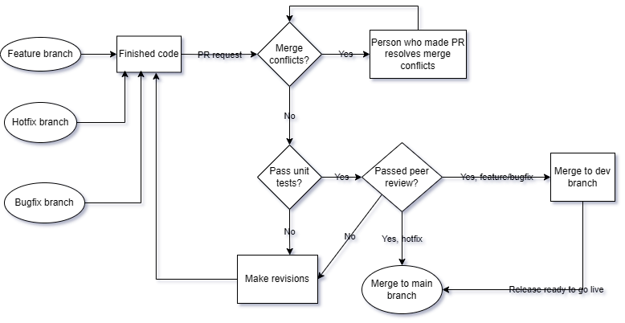

This file and all other files labeled 'phase 1' were originally uploaded on 2025-05-10 [here.](https://github.com/Team-Black-Hat-White-Hat/cse110-sp25-group02/blob/main/admin/cipipeline/phase1.md)

What is currently functional:
Unit testing: Team members should ensure the code works before doing a pull request. Given the difficulty of implementing generic tests for different components of the project, we are trusting team members to write unit tests for their own code that demonstrates their code functions correctly in all edge cases. 
This will make it easier for us to review each others’ code, since we can take a look at test cases to see what types of input is accepted, what output is expected, and what types of inputs should be rejected etc. which may be more helpful than examining the code itself.
We use jest, which has been set up such that ‘npm run test’ will run every test at every attempted push. Members can write the tests for what they are working on in individual [name].test.js files. All test files will run, including ones from other components, so we can be sure that tests don’t just run locally and fail when a change is merged.
Branch protection is set up so that pushes will not go through unless all tests pass (and for pull requests, they cannot be merged unless all tests pass.)
This is set up with GitHub Actions.

What is planned/in progress
We plan to have our branch organization as such when we start sprints:
1. main Branch (Production Branch)
This is the production branch that contains tested and deployable code.
No one should develop directly on main or push to it without a proper review.
We only merge into main when a release is ready to go live.

2. dev Branch (Development Mainline)
This is the integration branch where all feature development is merged.
Every developer's work (from feature branches) is pulled into dev.
Testing and integration happen here.
main is updated by merging code from dev.

3.feature/xxx Branches (Feature Branches)
Every new feature, module, or page should be developed in its own feature/xxx branch from dev.
Developers work independently in these branches.
Once completed, the feature branch is merged back into dev via a Pull Request.

	4.bugfix/xxx or hotfix/xxx Branches (Fix Branches)
bugfix/xxx: For fixing issues during development (branched from dev).
hotfix/xxx: For urgent production bugs (branched from main).