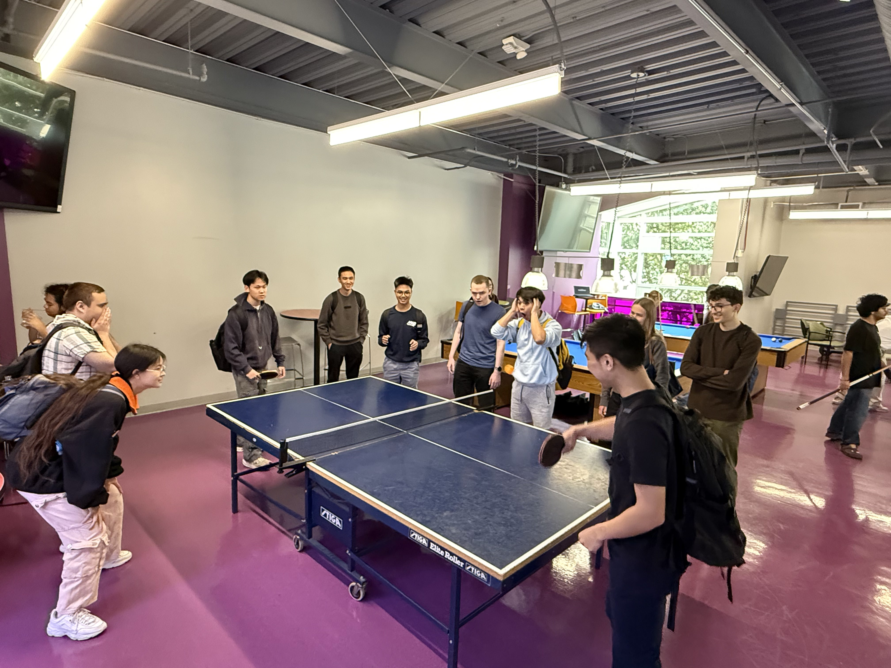

# 🐼 Team Black Hat White Hat  

  

## Brand:  
- 🐼🐼🐼 Pandas >  

## Important Values:  
>"Start Early, Start Often"  - CSE Department  

## Team Members:  

  <video width="640" controls>
    <source src="./videos/teamintro.mp4" type="video/mp4">
  </video>

- [Elvin Li](https://elvinlit.github.io/110-profile/)  
  - 3rd Year Math-CS  
- [Vivian Yu](https://v3yu.github.io/cse110/)  
  - 3rd Year Math-CS  
- [Rommel Cabotaje](https://rcabotaje.github.io/lab1cse110/#me-as-a-programmer)  
  - 3rd Year Computer Engineering  
- [Joshua Pham](https://phamjoshua6.github.io/Lab1/)  
  - 3rd Year Computer Science  
- [Saumya Sadh](https://ssadh123.github.io/saumya-s-110/)  
  - 4th Year Math-CS  
- [Mitchell Moundraty](https://mmoundraty.github.io/CSE-110-LAB-1/)  
  - 2nd Year Computer Science  
- [Yunsong Yang](https://faker1897.github.io/SoftwareLab1/)  
  - Extended Student  
- [Victoria Timofeev](https://vika-ti.github.io)  
  - 3rd Year Computer Science  
- [Evgenii Ruzin](https://evgenii-ruzin.github.io)  
  - 3rd Year Computer Science  
- [Alex Acevedo](https://alexandroacevedo.github.io/Lab-1-CSE110/)  
  - 3rd Year Computer Engineering  
- [Raeed Bourai](https://raeedbourai.github.io/cse_110_lab_1/)  
  - 3rd Year Computer Science  